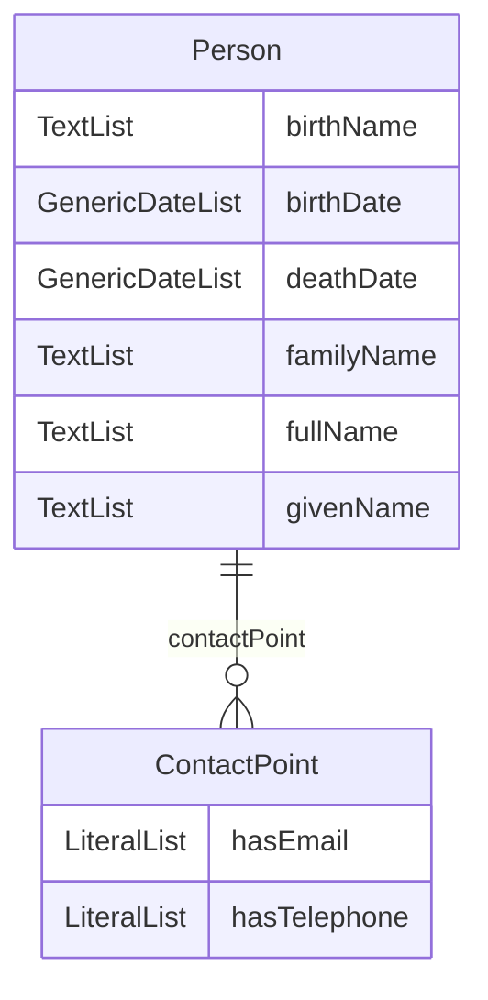

# Core Person Vocabulary
06 May 2024

### More details about this document
Latest published version:

- [https://semiceu.github.io/Core-Person-Vocabulary/releases/2.1.1/](https://semiceu.github.io/Core-Person-Vocabulary/releases/2.1.1/)

Latest editor's draft:

- [https://semiceu.github.io/Core-Person-Vocabulary/releases/2.1.1/](https://semiceu.github.io/Core-Person-Vocabulary/releases/2.1.1/)

## 1. Introduction

The Core Person Vocabulary provides a minimum set of classes and properties for describing a natural person, i.e. the individual as opposed to any role they may play in society or the relationships they have to other people, organisations and property; all of which contribute significantly to the broader concept of identity.

## 2. Classes

| Class | Description |
| --- | --- |
| [ContactPoint](ContactPoint.md) | Information (e.g. e-mail address, telephone number) of a person or department through which the user can get in touch with. |
| [Person](Person.md) | A individual human being who may be dead or alive, but not imaginary. |

## 3. Slots

| Slot | Description |
| --- | --- |
| [birthDate](birthDate.md) | The point in time on which the Person was born |
| [birthName](birthName.md) | Full name of the Person given upon their birth |
| [contactPoint](contactPoint.md) | The main contact information of the resource |
| [deathDate](deathDate.md) | The point in time on which the Person died |
| [familyName](familyName.md) | The hereditary surname of a family |
| [fullName](fullName.md) | The complete name of the Person as one string |
| [givenName](givenName.md) | The name(s) that identify the Person within a family with a common surname |
| [hasEmail](hasEmail.md) | An electronic address through which the Contact Point can be contacted |
| [hasTelephone](hasTelephone.md) | A telephone number through which the Contact Point can be contacted |

## 4. Enumerations

| Enumeration | Description |
| --- | --- |

## 5. Types

| Type | Description |
| --- | --- |
| [GenericDate](GenericDate.md) | The date data type is the union of xs:date, xs:gYearMonth and xs:gYear |
| [Literal](Literal.md) | The class of literal values, eg |
| [Text](Text.md) | The text data type is a combination of a string and a language identifier |