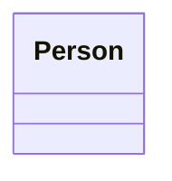

# Class: Person 


URI: [person:Person](http://www.w3.org/ns/person#Person)





<!-- no inheritance hierarchy -->


## Slots

| Name | Cardinality and Range | Description | Inheritance |
| ---  | --- | --- | --- |


## Identifier and Mapping Information


### Annotations

| property | value |
| --- | --- |
| rdfs:comment | A individual human being who may be dead or alive, but not imaginary. || rdfs:isDefinedBy | http://www.w3.org/ns/person# || skos:scopeNote | The Core Public Organization Vocabulary defines properties for telephone number, e-mail address and opening hours although it is noteworthy that the class is based on schema.org's ContactPoint class that has additional properties that some implementations may find useful. |


### Schema Source


* from schema: http://data.europa.eu/m8g/


## Mappings

| Mapping Type | Mapped Value |
| ---  | ---  |
| self | person:Person |
| native | http://data.europa.eu/m8g/Person |


## LinkML Source

<!-- TODO: investigate https://stackoverflow.com/questions/37606292/how-to-create-tabbed-code-blocks-in-mkdocs-or-sphinx -->

### Direct

<details>
```yaml
name: Person
annotations:
  rdfs:comment:
    tag: rdfs:comment
    value: A individual human being who may be dead or alive, but not imaginary.
  rdfs:isDefinedBy:
    tag: rdfs:isDefinedBy
    value: http://www.w3.org/ns/person#
  skos:scopeNote:
    tag: skos:scopeNote
    value: The Core Public Organization Vocabulary defines properties for telephone
      number, e-mail address and opening hours although it is noteworthy that the
      class is based on schema.org's ContactPoint class that has additional properties
      that some implementations may find useful.
from_schema: http://data.europa.eu/m8g/
class_uri: person:Person

```
</details>

### Induced

<details>
```yaml
name: Person
annotations:
  rdfs:comment:
    tag: rdfs:comment
    value: A individual human being who may be dead or alive, but not imaginary.
  rdfs:isDefinedBy:
    tag: rdfs:isDefinedBy
    value: http://www.w3.org/ns/person#
  skos:scopeNote:
    tag: skos:scopeNote
    value: The Core Public Organization Vocabulary defines properties for telephone
      number, e-mail address and opening hours although it is noteworthy that the
      class is based on schema.org's ContactPoint class that has additional properties
      that some implementations may find useful.
from_schema: http://data.europa.eu/m8g/
class_uri: person:Person

```
</details>